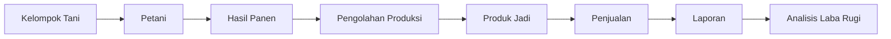
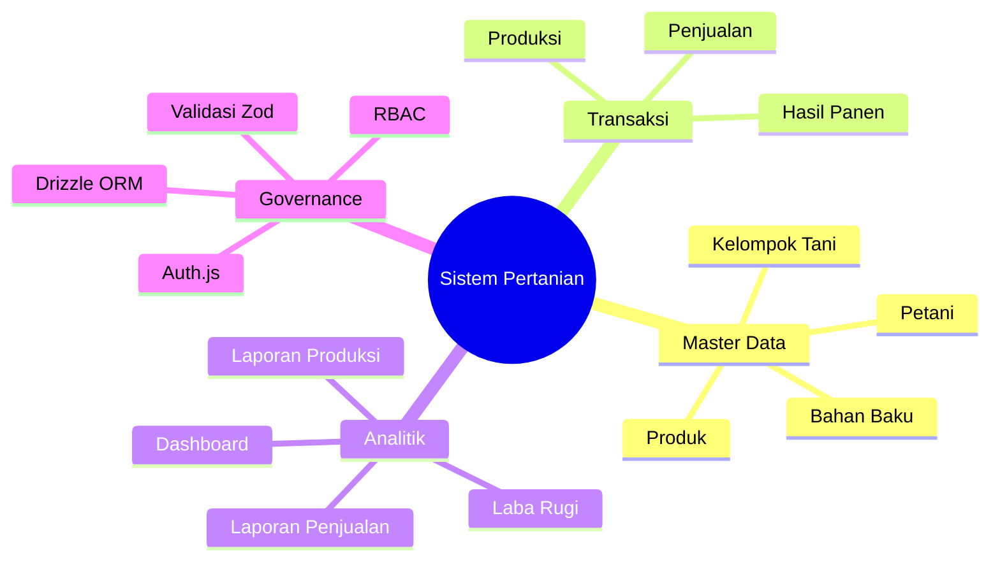
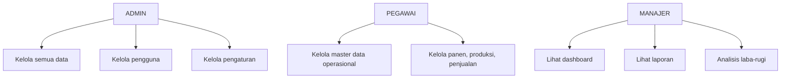
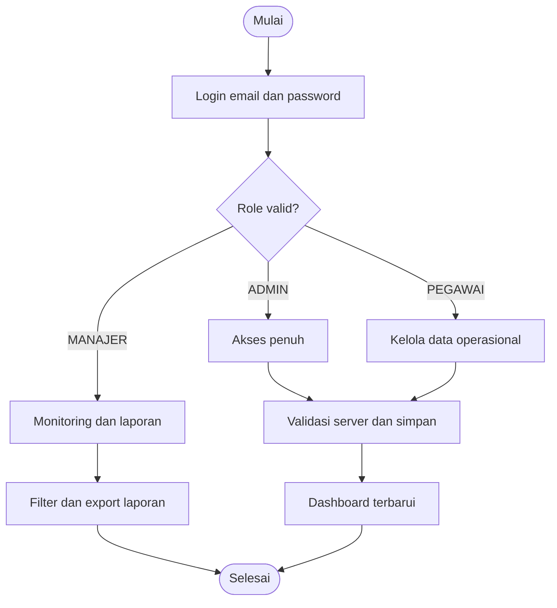
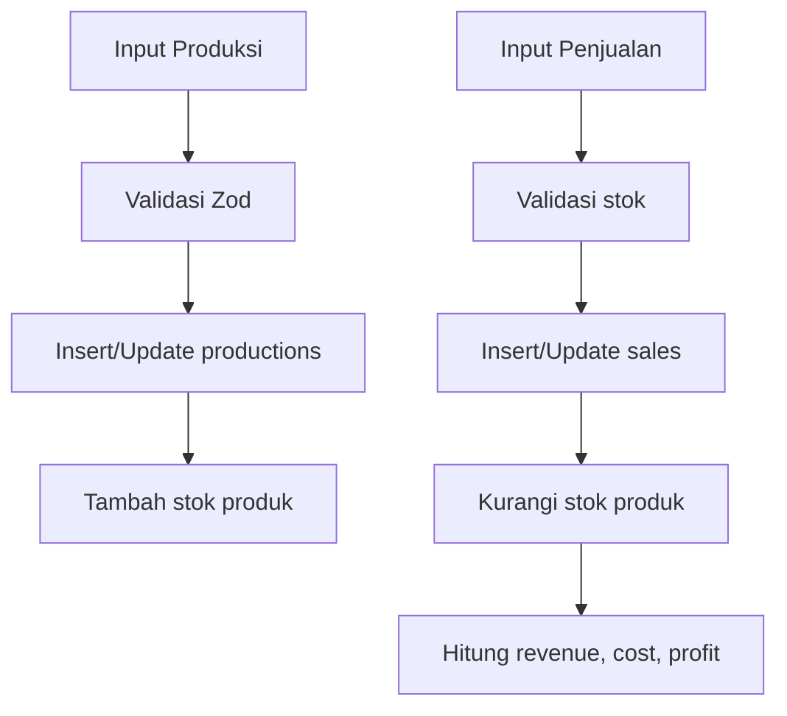
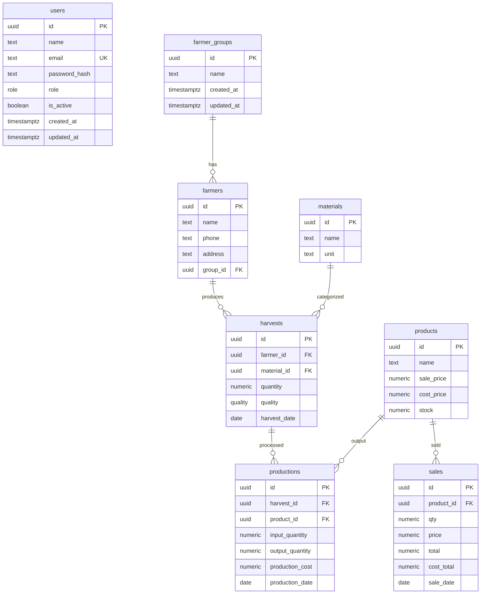
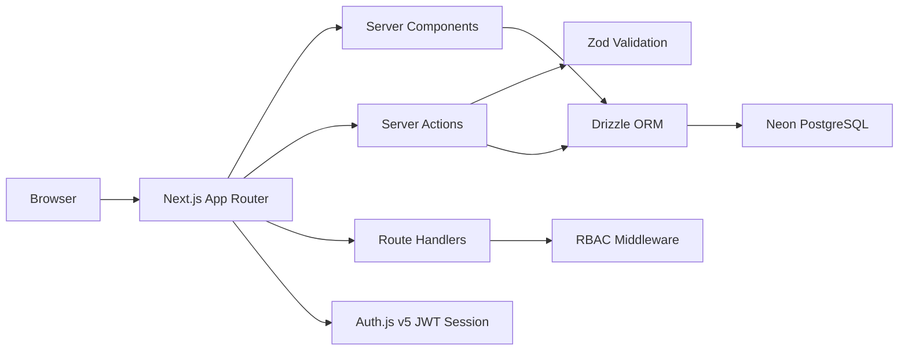

# PT MACROPRIMA PANGAN UTAMA

Sistem Informasi Produksi dan Penjualan Hasil Pertanian berbasis Next.js 15, Auth.js v5, Drizzle ORM, dan Neon PostgreSQL. Aplikasi ini mengelola alur bisnis dari kelompok tani, petani, panen, produksi, produk jadi, penjualan, laporan, hingga analisis laba-rugi.

## Overview

Tujuan sistem adalah mengurangi pencatatan manual dan menyediakan monitoring produksi, penjualan, serta profit secara cepat dan akurat. UI dirancang modern, minimalis, responsive, accessible, dan enterprise-grade sesuai SDD.

## Business Flow



## Kerangka Berpikir



## Use Case Diagram



## Activity Diagram



## Flowchart Mutasi Stok



## ERD



## Architecture Diagram



## Database Documentation

Tabel utama:

- `users`: akun, role tepat `ADMIN`, `PEGAWAI`, `MANAJER`, status aktif.
- `farmer_groups`: master kelompok tani.
- `farmers`: petani dengan FK ke kelompok tani.
- `materials`: bahan baku dan satuan.
- `harvests`: hasil panen dengan kualitas `SANGAT_BAIK`, `BAIK`, `SEDANG`, `BURUK`.
- `products`: produk jadi, harga jual, harga pokok, stok.
- `productions`: konversi panen menjadi produk jadi dan biaya produksi.
- `sales`: transaksi penjualan, total, dan cost untuk laba-rugi.
- `settings`: identitas aplikasi.

Semua tabel memiliki `id`, `created_at`, dan `updated_at`. Foreign key memakai cascade untuk mencegah orphan data. Index dibuat pada email, role, relasi utama, tanggal transaksi, dan nama produk/petani.

## Role Matrix

| Modul | ADMIN | PEGAWAI | MANAJER |
|---|---:|---:|---:|
| Dashboard | Read | Read | Read |
| Kelompok Tani | CRUD | CRUD | No Access |
| Petani | CRUD | CRUD | No Access |
| Bahan Baku | CRUD | CRUD | No Access |
| Produk | CRUD | CRUD | No Access |
| Hasil Panen | CRUD | CRUD | No Access |
| Produksi | CRUD | CRUD | No Access |
| Penjualan | CRUD | CRUD | No Access |
| Laporan Produksi | Read/Export | No Access | Read/Export |
| Laporan Penjualan | Read/Export | No Access | Read/Export |
| Laba Rugi | Read/Export | No Access | Read/Export |
| User Management | CRUD | No Access | No Access |
| Settings | CRUD | No Access | No Access |

## Installation Guide

1. Install dependencies:

```bash
npm install
```

2. Salin environment:

```bash
cp .env.example .env
```

3. Isi `DATABASE_URL` dari Neon PostgreSQL dan `AUTH_SECRET` yang kuat.

4. Generate dan jalankan migration:

```bash
npm run db:generate
npm run db
npm run db:push
```

5. Seed data demo:

```bash
npm run db:seed
```

6. Jalankan aplikasi:

```bash
npm run dev
```

## Deployment Guide

1. Buat project Vercel dari repository ini.
2. Tambahkan environment variables `DATABASE_URL`, `AUTH_SECRET`, dan `AUTH_URL`.
3. Jalankan migration ke database Neon sebelum traffic production.
4. Deploy dengan build command default `npm run build`.
5. Seed hanya untuk demo/staging; untuk production nyata gunakan data bisnis aktual.

## Demo Accounts

Password seluruh akun demo:

```text
password123
```

| Role | Email |
|---|---|
| ADMIN | admin@example.com |
| PEGAWAI | pegawai@example.com |
| MANAJER | manajer@example.com |

## QA Commands

```bash
npm run typecheck
npm run lint
npm run build
```

`npm run db:migrate` dan `npm run db:seed` membutuhkan `DATABASE_URL` Neon yang valid.
